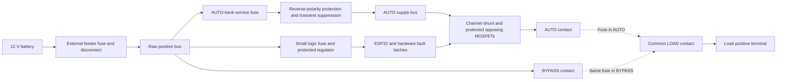
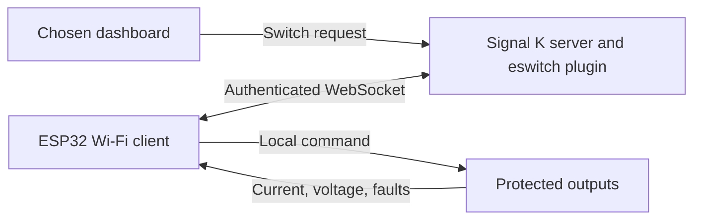

# eswitch: 12 V Signal K load controller with integrated fuse bypass

Design proposal · 20 September 2026 · Revision 0.2 · Requirements review

## 1. Recommendation and confirmed requirements

Build twelve independently protected, **10 A maximum** high-side outputs in one
package, controlled by an **ESP32 Wi-Fi client connected to a Signal K server**.
Each channel has one movable fuse selecting AUTO or BYPASS; removing the fuse
opens the positive feed. BYPASS remains a passive, fuse-protected power path
that operates without the MCU, Wi-Fi, or server.

The owner has confirmed:

| Item | Agreed requirement |
|---|---|
| Supply | Nominal 12 V only |
| Channels | Retain twelve; maximum individual load 10 A; detailed load information will follow |
| Loads | HALO20+ radar, USB charger, LED cabin and navigation lights, Raspberry Pi, NKE electronics, and NKE autopilot |
| Network | Wireless client of a Signal K server; no NMEA 2000/CAN hardware required |
| Network power | Signal K host, Wi-Fi access point, or both are powered through eswitch; exact channel/module assignments remain to be identified |
| Local control inputs | None |
| Bypass protection | Physical fuse only is acceptable, including possible supply disturbance while a fault clears |
| Fuse transfer | The affected load may lose power; **other channels must stay powered** |
| Fuse-transfer duty | Occasional emergency recovery, not routine manual switching |
| Controller restarts | Outputs may turn off during an MCU restart or firmware update, including navigation lights and autopilot |
| Ignition protection | Not required |
| Paralleled outputs | Not required; do not implement |
| Build | Three units, assembled by the owner using a hot-air soldering station |
| Publication | Likely open source; licensing and publication timing remain undecided |

Propose making all twelve channels capable of 10 A, with lower configurable
trip settings for smaller loads. This does **not** mean 120 A simultaneously.
The aggregate current requirement is still unknown. Retain **75 A only as a
provisional sizing and cost assumption**, not an owner-confirmed requirement.

Use one integrated protection/driver/current-monitor IC and two opposing MOSFETs
per channel. Use a shared ADC, one Wi-Fi module, direct wire terminals, an external
negative bus, and a stock enclosure. The final power-stage choice remains subject
to a complete comparison against integrated smart switches once loads are known.

**Preliminary materials allowance: about $180–300 per unit in a three-unit build,
plus any extra cost of a qualified live fuse-transfer mechanism.** This is not a
complete quotation. The live-transfer requirement is now the main unresolved
mechanical issue; section 4 explains why a cheap fuse-clip assembly is not yet
an established solution.

The old eight-channel hardware remains only in Git history at `d1de4a6`. Revision
0.1 of this proposal is in commit `ad722bb`. Neither is the hardware specification
for this revised design. No new hardware is released for fabrication.

## 2. Remaining questions

There is no need to repeat the answered questions. The following affect the next
engineering decisions; detailed load information can arrive later as planned.

| Priority | Question | Recommendation / consequence |
|---|---|---|
| 1 | **Which Signal K server implementation/version and control dashboard will you use? Can it run a small eswitch server plugin?** | Propose the Node.js Signal K server with an open-source plugin that handles switching commands and telemetry. Dashboard choice can follow. |
| 2 | **Which modules/channels power the Signal K host and access point, and is the listed Pi the Signal K host?** | One or both are confirmed to use eswitch. Identify their feeds so each can be commissioned for local automatic startup and intentional network interruption. No separate power supply is required by this proposal. |
| 3 | **What simultaneous current should each module support?** | Keep the provisional 75 A envelope until the load list arrives. Reducing this may save more than changing the Wi-Fi MCU. |
| 4 | **Does “NKE autopilot” include the drive motor, or only its instruments/computer? Which model?** | A 10 A channel cannot be assumed to support an unspecified drive's startup/stall current. Keep an oversized drive on its own protected feed if necessary. |
| 5 | **Which cabin-light circuits actually need dimming, and are their LED drivers supply-PWM compatible?** | Retain dimming capability; default all equipment and navigation lights to ON/OFF. Do not PWM a charger, radar, Pi converter, or autopilot supply. |
| 6 | **Where will the modules live: dry locker, damp/splash area, or enclosed metal cabinet? What enclosure size is practical?** | No ignition requirement does not establish water exposure or Wi-Fi coverage. A dry location and antenna clearance are preliminary assumptions. |
| 7 | **What is the materials budget per finished unit?** | Current allowance excludes any live-transfer mechanism premium, external wiring, tools, shipping, and labor. |

Before selecting final protection values, collect minimum operating/charging
voltage, hot ambient temperature, feeder and battery fault-current information,
wire lengths/gauges, and manufacturer fuse recommendations. For the Pi and USB
charger, include the **12 V input converter** model and input current. The board
switches their 12 V supply; it does not supply a Pi directly with 12 V or include
twelve regulated USB outputs.

## 3. What is retained from the reference products

The [CLMD12 datasheet](https://www.maretron.com/products/pdf/CLMD12%20Datasheet.pdf)
provides the initial switching, measurement, and dimming reference. Its mixed
5/10/12 A channels are replaced with our proposed uniform 10 A channels. Its
[manual](https://www.maretron.com/support/manuals/CLMD12UM_1.9.pdf) describes
opposing MOSFETs and hardware protection; those principles remain useful.

| Function | This design |
|---|---|
| Output switching | Twelve separate high-side channels; no paralleling |
| Current measurement | Each AUTO channel; target 0.1 A reporting resolution and approximately ±0.5 A or better over the useful range, subject to calibration |
| Programmable electronic protection | Per-channel trip threshold and timing within qualified hardware limits |
| Dimming | Target 200 Hz, 5–100% with 1% command steps, plus true OFF; only enabled for suitable lighting |
| Power-up behavior | Local OFF/ON/previous-state configuration, with fault state taking priority |
| Command locks and status | Implement in firmware and the Signal K interface |
| Fault isolation | Hardware shutdown of the faulty AUTO channel, independent of firmware |
| Manual recovery | Integrated passive fuse bypass; live branch transfer must be engineered |
| Local switch inputs | Removed at the owner's request |
| NMEA 2000 and proprietary Maretron configuration | Removed; use Wi-Fi and Signal K |

The [CBMD12](https://www.maretron.com/products/mpower-cbmd12-12-channel-optional-bypass-module/)
provides fused manual operation without dimming. Our fuse selection replaces its
rocker controls. BYPASS has no electronic trip setting, remote OFF, or guaranteed
current measurement. A smaller electronic trip threshold does not change the
protection provided by the physical fuse in BYPASS.

Neither an ingress rating nor ignition protection is claimed. The owner's
acceptance of restart interruptions avoids adding a second processor or hardware
command-retention system solely to keep loads on through an MCU restart.

## 4. Power architecture and live fuse transfer



The channel section repeats twelve times. The dashed paths are alternative fuse
positions; only one fuse is installed per channel. Load negatives return to the
existing vessel negative bus. The module has a negative connection sized for
its electronics and suppression currents.

```text
      A                     L                     B
  AUTO output           LOAD terminal          raw battery +
      o                     o                     o

  AUTO:    fuse connects A–L
  BYPASS:  same fuse connects L–B
  OFF:     fuse removed and stored in an insulated parking position
```

Place the selector **after the electronic switch** so moving the fuse removes
the AUTO-output connection. Do not simply bridge a fuse across the MOSFET: that
leaves the load connected to potentially failed electronics.

### What “other channels stay powered” requires

The module's feeder remains energized during an individual fuse move. The
removed fuse interrupts only that branch; this meets the requested electrical
behavior. It also means the selector may make or break load current:

- Healthy AUTO can be commanded OFF first, reducing removal stress. This is an
  operating aid, not the sole safety mechanism.
- Inserting the fuse into BYPASS can connect a discharged input capacitor or a
  running/startup load directly to battery power.
- Removing a BYPASS fuse, or an AUTO fuse after a switch fails ON, can interrupt
  the full branch current. Software cannot turn either condition off reliably.

**The selector must be qualified for these live operations at the defined 12 V
voltage envelope, up to 10 A operating load, and the specified inrush/inductive
loads.** A clip's continuous-current rating alone does not establish load-making
or load-breaking capability. Ignition protection is outside the requested scope;
contact arcing, wear, and accidental shorts still determine whether the mechanism
is suitable. Qualify for occasional emergency transfers, including an agreed
service-life allowance; this is not a routine manual load switch.

The [Keystone 3557](https://www.keyelco.com/product.cfm/product_id/1131) remains a
low-cost *candidate contact*, not an approved live-transfer assembly. Require
manufacturer support for the intended duty or engineering qualification of the
complete mechanism. If simple clips cannot meet it, prefer a passive fuse carrier
whose movement operates suitable load-break contacts. An additional branch
isolator would be a departure from the requested fuse-only interface and needs
an explicit design decision. A shared upstream disconnect is not an acceptable
routine transfer procedure because it would interrupt the other channels.

This is an unresolved design gate, not an assertion that a bare three-clip holder
can be moved live. Do not freeze the PCB footprint or cost before resolving it.
A firmware-dependent device in the BYPASS path would also change the promised
independence and is not the proposed workaround.

Use a guarded, break-before-make arrangement that prevents two installed fuses,
misalignment into adjacent channels, and contact with unused live terminals.
Provide retention and supports underneath the fuse area. Test AUTO→BYPASS,
BYPASS→AUTO, fuse removal to OFF, and a failed-ON AUTO switch, with the other
channels loaded. Contact bounce and load inrush must not reset healthy loads
or the module logic during an ordinary transfer.

### Protection domains and limits

The AUTO-bank service fuse allows an internally shorted electronic power bank
to be isolated; logic has its own small fuse. Size both and coordinate them with
the feeder protection. Internal-fault recovery may require taking the module out
of service; the live-transfer requirement does not make a damaged common bus
independently repairable.

BYPASS operates with missing firmware, Wi-Fi, server, or gate drive, and can
isolate a failed channel switch by removing the AUTO fuse connection. It cannot
overcome a lost feeder, shorted common bus, or destructive PCB damage. Combining
the functions in one enclosure shares physical failure exposure.

## 5. Power electronics

Use twelve repeated **TPS12110A-Q1** controller circuits initially, each with two
opposing N-channel MOSFETs, one Kelvin-connected shunt, and output suppression.
The [TI controller family](https://www.ti.com/product/TPS1211-Q1) combines gate
drive, protection, voltage supervision, and an analog current monitor. Its gate
current rating is not the permitted load current through the external MOSFETs.

At the new 10 A maximum, a 3 mΩ shunt develops 30 mV and dissipates 0.30 W.
Select its package for hot operation and fault pulses. Share ADC/multiplexer
resources instead of buying twelve separate current-monitor ICs. Synchronize
PWM measurements with on-time and distinguish on-state current from averaged
telemetry; averaging must not hide an overload.

The fast hardware threshold protects the power stage. Lower configurable
current/time thresholds protect the intended load in normal firmware operation;
the physical fuse remains the independent backup sized for the actual wiring.
Do not represent the firmware setting as a precision hardware current clamp.

**Use a persistent fault latch per channel.** The
[TPS1211 datasheet](https://www.ti.com/lit/ds/symlink/tps1211-q1.pdf) describes
input toggling clearing its internal overcurrent latch and temperature retry on
the TPS12110 variant. Our external latch must prevent PWM or an MCU reset from
causing repetitive retries. Default outputs OFF on loss of logic power and
through boot; reset a fault only by a deliberate operation. Hardware protection
continues without the ESP32 running.

Fit local temperature sensing near each channel's power devices. Check sensor
lag and trip temperature against the MOSFET, shunt, terminals, and PCB limits.
Board-temperature telemetry provides earlier warning. Merely measuring the
driver IC temperature does not establish external MOSFET/contact temperature.

Select MOSFET voltage rating, hot resistance, gate charge, and safe operating
area against the actual transient and startup envelope. For illustration,
120 nC combined gate charge at 200 Hz needs 24 µA average charging current before
leakage and margin. Verify both the driver's charge-pump budget and minimum PWM
pulse width. Large capacitive loads may need precharge, but do not fit it to
every channel without a demonstrated need.

Use a shared AUTO-bank reverse-polarity stage, as illustrated in
[TI's reverse-battery application note](https://www.ti.com/lit/pdf/SLUAAN7),
and separately protect the low-power regulator. Select transient suppression
against a defined source pulse and worst-case clamp voltage. Use a higher-voltage
controller if protecting the 45 V absolute-maximum device is not economical.
Do not use a shared electronic current limiter as the primary response to an
ordinary branch short.

Provide an inductive suppression path compatible with the complete opposing-FET
circuit. Check long-wire interruption, relay coils, motor startup/stall, and
fuse transfer. Passive BYPASS deliberately precedes electronic reverse-polarity
and overvoltage protection, so those conditions can reach bypassed loads.

### Alternative to compare before selecting the BOM

Six [TPS2HCS10-Q1 dual smart switches](https://www.ti.com/product/TPS2HCS10-Q1)
can reduce component count by integrating switches, sensing, PWM, and protection.
Compare their **complete** cost, including output reverse blocking, heat removal,
and fault interaction between channels in one package. The new 10 A maximum
makes this comparison more attractive, but total simultaneous current is still
unknown. Do not select on IC price alone or silently discard reverse blocking.

## 6. Wi-Fi controller and Signal K integration

### Hardware and network choice

Use an **ESP32-S3-WROOM-1-N8** module initially, without PSRAM. It combines the
processor, radio, flash, and antenna in an assembly suitable for hot-air reflow.
See [Espressif's module documentation](https://documentation.espressif.com/esp32-s3-wroom-1_wroom-1u_datasheet_en.html).
Size the regulator for Wi-Fi transmit bursts, not average idle draw, and keep
radio supply/ground noise away from current measurement.

Allocate twelve hardware PWM outputs using LEDC plus MCPWM resources; the S3 has
eight LEDC channels, so twelve LEDC channels must not be assumed. Confirm the
GPIO/timer map before schematic release. The
[ESP32-S3 datasheet](https://documentation.espressif.com/esp32_s3_datasheet_en.pdf)
documents these peripherals. Use ADC1 or a suitable external ADC with multiplexing
and calibration; measure accuracy while Wi-Fi is transmitting. GPIO expansion
may be used for fault readout/reset, never as the sole fast protection path.

No physical load-switch inputs, CAN transceiver, isolation supply, Micro-C
connector, or NMEA protocol stack are included. Programming/reset access remains.
Prefer a plastic enclosure or antenna window; use an external-antenna module
variant if a metal cabinet prevents dependable reception.

**Wi-Fi is the recommended system choice here.** It connects directly to the
requested server and avoids CAN cabling and a CAN-to-server adapter if those are
not already installed. A bare CAN transceiver can be cheap, but that is not the
cost of a working Signal K connection. Wired CAN would be worth reconsidering
for poor radio coverage or a future requirement for wired distributed control,
not simply to save a few dollars on this build.

This module switches the power feeds of the radar and NKE equipment. It does
not implement their radar-data, instrument-data, or autopilot-steering interfaces.

### Proposed software connection



Have each module open an outbound connection to a small open-source Signal K
server plugin. The plugin registers switching command handlers and translates
telemetry into Signal K deltas. This is a proposed application protocol on a
plugin endpoint; a generic telemetry-only Signal K client is not automatically
a remotely controllable actuator. Confirm compatibility with the installed
server version before implementing it.

Signal K distinguishes **PUT commands** from **state-update deltas**. The plugin
must wait for a device acknowledgement or a bounded timeout rather than report
success because the server's data model changed. Use the documented
[PUT semantics](https://signalk.org/specification/1.7.0/doc/put.html) and
[request/response states](https://signalk.org/specification/1.7.0/doc/request_response.html).
Keep desired state, acknowledged switch state, and measured output voltage
separate. A passive bypass or external feed can make an output live while its
AUTO switch is OFF.

Use stable module IDs plus channel IDs so three modules do not overwrite each
other. Map them to paths such as `electrical.switches.<stableChannelId>.state`;
validate exact paths/types against the deployed schema. Store human circuit
names separately. Include request IDs, reject stale or duplicate operations,
bound reconnection queues, and do not replay historical ON/OFF commands after
an outage. Publish a fresh state snapshot before accepting a new command session.

Authenticate devices and authorized control clients; use TLS with provisioned
server trust where available. The
[Signal K plugin guide](https://demo.signalk.org/documentation/Developing/Plugins.html)
explicitly assigns authentication of plugin WebSocket endpoints to the plugin.
Do not assume registering an endpoint secures it. Signal K's
[access-request mechanism](https://signalk.org/specification/1.7.0/doc/access_requests.html)
can support enrollment where the chosen server permits it. Credentials remain
local and are excluded from open-source releases.

Provide USB/service recovery and local Wi-Fi provisioning. Normal operation is
Wi-Fi station mode; no cloud service or Internet connection is needed. Support
OTA with image verification and rollback. Updating/rebooting may interrupt AUTO
outputs, as accepted; an OTA operation must be deliberate and its interruption
shown before it starts. BYPASS continues through an ESP32 restart.

### Operating policy

| Event | Proposed behavior |
|---|---|
| Wi-Fi, server, or plugin disconnected | Hold the last commanded AUTO state; local protection remains active. Mark telemetry unavailable/stale. |
| Connection restored | Report current state and faults; do not blindly apply a cached server state. |
| ESP32 reset, watchdog trip, or firmware update | AUTO outputs OFF during restart; BYPASS unaffected. |
| Successful boot | Apply each channel's stored OFF/ON/previous-state policy locally without waiting for Signal K; stagger starts where needed. |
| Commissioned server/access-point supply | Use local ON-at-boot policy, with protection taking priority. These channels must not depend on a network command or a persisted previous-OFF state to recover after a restart. |
| Invalid settings or unfinished commissioning | Default AUTO outputs OFF. |
| Channel fault | Latch off; do not reinterpret it as an ordinary command or automatically restart it. |
| Known fault before restart | Do not restore it as “previous ON”; define persistent fault/state storage and test interrupted writes. |

Maintain command locks, names, trip curves, dimming settings, state persistence,
and fault logs. Store versioned configuration with integrity checks. Protection
always overrides a command lock. Software may shed AUTO loads against a configured
budget, but cannot enforce the total when passive BYPASS channels are active.

### Boot and service when eswitch powers the network

The Signal K host, access point, or both **will be powered through eswitch**.
Identify their module/channel assignments during commissioning and set those
channels to local ON-at-boot, independent of Wi-Fi association or a server
connection. Allow outputs to start before networking completes. Each module
must recover independently, even when another module powers the network.
Fault protection still takes priority; a faulted infrastructure channel must not
retry indefinitely to restore connectivity.

Ordinary dashboards should lock these feeds against accidental OFF commands.
Provide an explicit maintenance action for deliberate shutdown. If a remote
power cycle is wanted, the module must first accept the whole timed OFF/ON
operation and execute it locally; never rely on a second command reaching a
powered-off server or access point. A latched fault cancels the planned restart.
Persisted commissioning settings identify these feeds; uncommissioned or corrupt
settings still default OFF and require local service or passive bypass.

An ESP32 restart may interrupt these feeds, as accepted. For OTA, receive and
verify the complete image locally before rebooting; boot, rollback, and load
restoration must work with the server/access point unavailable. Tell the user
which network services will drop before starting maintenance, and report final
status after reconnection. Qualified passive BYPASS can keep a selected network
feed on through controller maintenance; USB service remains available offline.

If the Pi runs Signal K, define a graceful host shutdown/restart procedure before
planned power interruptions. A simple output delay is not proof that its OS has
shut down; watchdog resets or loss of battery power can still interrupt it.
Power switching alone does not provide graceful OS shutdown.

## 7. Fuses, aggregate current, and mechanics

Electronic trip threshold, qualified channel capacity, and fuse rating are
separate values. A 10 A continuous load may require a higher nominal fuse after
thermal derating, but the wiring and PCB must survive that fuse's clearing curve
in BYPASS. The fuse must never become an undocumented permission to run more
than the channel's 10 A maximum.

For example, [Littelfuse ATOF fuses](https://www.littelfuse.com/assetdocs/littelfuse-datasheet-287-atof?assetguid=43dcdce8-8ca2-426f-8998-7e566f048d40)
have a 1,000 A interrupt rating at 32 V DC. Confirm prospective branch fault
current and upstream coordination for the installation. A feeder fuse does not
automatically increase a branch fuse's interrupt rating. Fuse interruption of a
fault and manually extracting a loaded fuse are different duties.

| Fault | Required behavior / boundary |
|---|---|
| AUTO load short, including at startup | Channel hardware shuts down; validate that healthy loads and logic remain operating. |
| BYPASS short | Physical fuse clears; a temporary shared supply dip is accepted. |
| Ordinary fuse transfer | Only the selected branch drops out; validate with the other branches loaded. |
| AUTO switch fails ON | Qualified manual fuse mechanism must still disconnect or transfer that branch. |
| Internal power-bank short | AUTO service fuse/feeder coordination and manual isolation govern recovery. |
| Reversed battery or sustained overvoltage | AUTO protection works within its specified envelope; BYPASS exposes its load to the raw feed. |

With twelve 10 A channels, the sum of individual maxima is **120 A**. Neither
simultaneous capacity nor feeder sizing follows from that sum. For the provisional
75 A assumption, the greatest sum of squared branch currents is 725 A²: seven
10 A loads and one 5 A load. With an assumed 6 mΩ of hot MOSFET resistance plus
a 3 mΩ shunt per path, that is **6.53 W** in channel MOSFETs/shunts. A further
1 mΩ common-feed resistance adds **5.63 W**; a hypothetical average 0.1 V fuse
drop adds **7.5 W**. These are illustrative calculations, not measured losses.

Reserve approximately **20–30 W of heat-removal capacity** in early mechanical
planning if retaining 75 A. Replace these assumptions with maximum component
and connection losses. Propose qualification at 55°C ambient, pending the actual
installation. Reducing aggregate current could substantially reduce the enclosure
and copper needed.

Start with a four-layer PCB, 2 oz outer copper, and a mechanically anchored copper
bus strip where economical. Support power terminals independently of solder
joints. Keep branch routes short and provide thermal spreading. Compare a metal
backplate with a larger PCB while preserving Wi-Fi antenna clearance.

Keep two accessible rows of six fuse positions as a layout objective. Initial
PCB space allowance remains around 250 × 150 mm, subject to the live-transfer
mechanism; do not lock this footprint now. Include an insulating shroud, clear
AUTO/BYPASS markings, unused-contact guards, and fuse parking. Conformal coating
does not waterproof contacts or establish an ingress rating.

Use footprints suitable for stencil paste and hot air: castellated radio module,
lead-accessible controller packages, sensible passive sizes, and power packages
with achievable reflow inspection. Provide test points and space for rework.
Validate one assembled board before populating the other two.

## 8. Cost decisions and preliminary budget

The confirmed savings are removal of CAN hardware/connectors, seven input
circuits and their connector, and all paralleling support. Wi-Fi replaces the
MCU rather than adding a second processor. Use shared measurement, inexpensive
direct wire terminals, and an external negative bus. Preserve independent AUTO
protection, off-state reverse blocking, and adequate contact/copper quality.

Estimated USD **per unit**, using quantities appropriate to buying parts for
three units. Each BOM will still list installed quantities for one module.
These allowances assume the provisional 75 A envelope.

| Item | Installed per module | Allowance |
|---|---|---:|
| TPS12110A-Q1 controllers | 12 | $35–40 |
| Opposing channel MOSFETs | 24 | $24–40 |
| Current shunts | 12 | $6–12 |
| Fault latches, channel suppression, gate/timing parts | 12 sets | $14–26 |
| Basic fuse contacts, **not yet live-transfer qualified** | 36 | $5.50–8 |
| Branch fuses | 12 | $8–14 |
| AUTO service fuse/holder and input protection | Shared | $18–32 |
| ESP32-S3 radio/MCU module | 1 | $6–8 |
| Logic power, ADC/multiplexing, indicators, service connection | Shared | $10–18 |
| Power/output terminals and copper bus | One set | $15–28 |
| PCB | One board allocation | $15–30 |
| Basic enclosure, shroud, supports, hardware | One set | $20–40 |
| **Base materials subtotal** | **Rounded allowance: $180–300 per unit** | **$176.50–296** |
| **Live-transfer mechanism premium / extra qualification** | **Unresolved** | **TBD** |

The base allowance for three units is roughly **$540–900**, **plus the unresolved
live-transfer cost**. This supersedes the earlier $200–330 single-unit estimate;
it must not be quoted as a completed, qualified product price.

Price anchors reviewed on 20 September 2026:

- [TPS12110AQDGXRQ1](https://www.digikey.com/en/products/detail/texas-instruments/TPS12110AQDGXRQ1/17748310):
  $2.8584 at the 25-piece tier; 36 controllers for three boards gives about
  $34.30 installed per board.
- [Keystone 3557](https://www.digikey.com/en/products/detail/keystone-electronics/3557/2092485):
  $0.1518 at the 100-piece tier; 108 contacts gives about $5.46 per board.
- [ESP32-S3-WROOM-1-N8](https://www.digikey.com/en/products/detail/espressif-systems/ESP32-S3-WROOM-1-N8/15200089):
  $5.66 at single-piece quantities; three modules cost $16.98 before extras.

Other lines are engineering allowances. Refresh all prices and availability when
selecting the exact BOM. Shipping, tax, tariffs, spares, tools, assembly labor,
firmware/plugin development, tests, and external feeder wiring/protection are
excluded. PCB minimum orders can increase cash outlay. Antenna changes or a more
substantial fuse carrier may increase the enclosure/interface cost.

Likely open-source publication favors public component documentation, ordinary
KiCad files, reproducible firmware/plugin builds, and available parts. Prepare
those artifacts as the project develops, but choose hardware, firmware, and
plugin licenses before publishing; no license or publication action is assumed
from “most likely.”

## 9. Next engineering work

1. Select and qualify a live-transfer contact mechanism for occasional emergency
   use. Identify the server/network feed assignments and Signal K software target;
   establish the eventual aggregate load requirement when load details arrive.
2. Define the actual voltage and fault envelope; calculate fuse coordination,
   inrush, inductive suppression, MOSFET safe operating area, and hot losses.
   Compare the complete integrated-smart-switch alternative before BOM selection.
3. Prototype one power channel **and its transfer mechanism**. Test load-making,
   load-breaking, bounce, wear, fault latch persistence during PWM/reboot, and
   backfeed isolation before routing twelve copies.
4. Verify a Signal K command/acknowledgement/telemetry round trip with a bench
   device, three unique module identities, network loss/reconnect, and stale
   command rejection. Keep this separate from power-stage qualification.
5. Develop the schematic, one-module BOM, PCB, and assembly procedure; build and
   validate one board, then assemble the other two.
6. Test admitted simultaneous loads, all-BYPASS heating, startup into faults,
   mixed AUTO/BYPASS startup, live transfer with healthy channels loaded, Wi-Fi
   burst interference, MCU restart, OTA interruption/recovery, and cold startup
   of all three modules with the host/access point initially unpowered. Verify
   local network-feed power cycles and fault handling without server assistance.

This revision records the owner's decisions and the resulting design changes.
It does not claim that the new live-transfer mechanism, continuous-current
rating, or complete hardware has been built or qualified.
