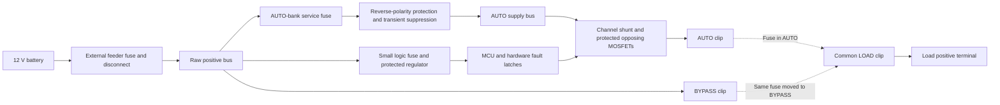

# eswitch: 12 V, twelve-channel load controller with integrated fuse bypass

Design proposal · 20 September 2026 · Revision 0.1 · For requirements review

## 1. Recommendation

Build one serviceable module with twelve protected high-side outputs, seven
local switch inputs, an isolated CAN interface, and twelve movable blade fuses.
Each fuse selects **AUTO**, **BYPASS**, or, when removed, **OFF**. BYPASS feeds
the load directly through its fuse and physically disconnects it from the
channel's power electronics.

**12 V only is confirmed.** Retain the reference product's 2 × 12 A, 6 × 10 A,
4 × 5 A output capability and 75 A aggregate target unless the actual load list
allows a cheaper design. These are proposed design targets, not qualified ratings.

My starting power stage is one protection/driver IC and two opposing MOSFETs
per channel. This retains off-state reverse-current blocking, hardware fault
shutdown, current measurement, and dimming without a separate current-monitor
IC on every channel. Use inexpensive fuse clips, direct wire terminals, a shared
microcontroller, and a stock enclosure. Avoid a display, onboard wireless,
per-channel relays, and a separate bypass board in the base design.

**Budget approximately US$200–330 in materials for one hand-assembled enclosed
prototype.** This is a preliminary allowance, not a quoted BOM. The cost target
is toward the lower end; the major unknowns are cooling, connectors, and fault
coordination. Cost details and alternatives appear in section 9.

This is a new design basis. The previous eight-channel design is retained only
in Git history at `d1de4a6`. Its voltage limits, special bypass protection,
component choices, and prototype-release status are not silently carried over.

## 2. Questions that affect the design

Answer these first; the recommendations below let the proposal remain concrete
without treating unanswered questions as agreement.

| Priority | Question | Proposed starting point / effect |
|---|---|---|
| 1 | **What must control it: a particular chartplotter, Maretron display/keypad, another CAN device, or your own application?** Include model names if known. | Preserve an isolated NMEA 2000-capable interface. Actual display compatibility must be demonstrated; it is a significant firmware requirement. |
| 2 | **Do you need the full 75 A total and 2 × 12 A / 6 × 10 A / 4 × 5 A arrangement?** A rough list of the twelve loads and their running/startup currents is enough initially. | Keep these targets for now. Lower simultaneous current can reduce copper, terminals, enclosure size, and cooling costs. |
| 3 | **Is fuse-only protection in BYPASS acceptable, including a possible brief supply dip while a shorted branch's fuse clears?** | Recommend yes for a passive, inexpensive bypass. Guaranteed uninterrupted healthy outputs during a bypass short requires further protection and changes this architecture. |
| 4 | **Can the supply be disconnected while moving a fuse, and will the module be installed in a dry, accessible location outside spaces requiring ignition protection?** | These are conditions of the inexpensive enclosure/fuse arrangement. A wet or ignition-protected installation changes the mechanical design and qualification effort. |
| 5 | **How many units, what materials budget per unit, and who will assemble them?** | Cost table assumes one unit bought at ordinary distributor quantities and assembled by hand. No batch size or single-distributor restriction is assumed. |
| 6 | **Are paralleled outputs actually needed for any load above 12 A?** | Recommend individual outputs in the first version; paralleling is a stated departure requiring your decision, not an assumed retained feature. |
| 7 | **Do you need Wi-Fi/web configuration, or is a wired service connection sufficient?** | Use wired configuration initially. Add wireless only if it provides a needed control/configuration path. |

Before final component selection, also establish the acceptable operating voltage
range, highest charging voltage, hot ambient temperature, maximum enclosure size,
wire entry preference, and whether this is a personal build or a product for sale.
Battery fault-current and feeder/fuse details can follow during protection sizing;
they are not needed to answer the architecture questions above.

## 3. Functionality to retain, and explicit differences

The [CLMD12 product page](https://www.maretron.com/products/mpower-clmd12-12-channel-dc-load-controller-module/)
sets the principal channel, input, and control functions. The
[CLMD12 datasheet](https://www.maretron.com/products/pdf/CLMD12%20Datasheet.pdf)
provides the numerical comparison below.

| Function | Reference baseline | Proposed design |
|---|---|---|
| Load switching | 12 high-side channels; 2 × 12 A, 6 × 10 A, 4 × 5 A; 75 A total | Retain as targets; independently validate thermal limits. |
| Supply | 6.5–32 V; 12/24 V systems | **12 V only.** Propose 9–16 V full operation; lower-voltage cranking operation is an open requirement. |
| Dimming | 200 Hz PWM, 5–100%, 1% steps | Retain for compatible lighting; include true OFF. Motors/electronics default to ON/OFF. |
| Current telemetry | Each channel; 0.1 A resolution; typical ±0.5 A accuracy | Target equal or better over the useful load range; calibrate the complete measurement path. |
| Electronic breaker settings | Programmable trip levels in 1 A increments | Retain selectable thresholds/delays within each channel's qualified limits. |
| Local inputs | Seven inputs with high/low activation | Retain; protected sensing of battery positive, ground, and open contact. |
| Power-up and locks | ON/OFF/previous-state settings; command locks | Retain in firmware, with fault state taking priority. |
| Network | Isolated NMEA 2000 | Retain hardware capability; verify protocol and chosen user interface. |
| Manual recovery | Fused bypass module | Integrate into the same package using fuse relocation. |

The [CLMD12 manual, sections on electronic breakers and paralleling](https://www.maretron.com/support/manuals/CLMD12UM_1.9.pdf)
also identifies opposing MOSFETs, hardware fault protection, software load
protection, and output paralleling. The first three inform this proposal;
paralleling remains an explicit question.

The [CBMD12 product description](https://www.maretron.com/products/mpower-cbmd12-12-channel-optional-bypass-module/)
specifies fused manual control, without dimming or paralleled outputs. Its
[installation manual, pages 1 and 4](https://www.maretron.com/support/manuals/CBMD12UM_0.pdf)
identifies IP53 with the cover closed and states that the bypass module is not
ignition protected. The CLMD12's separate IP67/ignition-protection claims must
therefore not be attributed to the entire combined arrangement.

Explicit differences requiring acceptance:

- Moving a fuse requires de-energizing the supply. Manual switching under load
  is not retained.
- The new assembly has no claimed IP or ignition-protection rating. A covered,
  dry-location design is the cost baseline.
- BYPASS has no electronic trip setting, dimming, remote OFF, or guaranteed
  current telemetry. It remains fuse protected.
- Generic network compatibility does not imply compatibility with Maretron's
  proprietary configuration tools, automation formats, or every chartplotter.
- Paralleled output operation is not included until its need and bypass behavior
  are resolved.

## 4. Power architecture and fuse selection



The channel section repeats twelve times. Dashed paths are alternative physical
fuse positions: **one fuse per channel, not two installed fuses**. Loads return
to the vessel's existing negative bus; keeping twelve high-current negative
returns off this PCB saves copper, terminals, and heat. The module needs a
separate negative connection for its electronics and suppression circuits.

Each selector uses three contacts in a row:

```text
      A                     L                     B
  AUTO output           LOAD terminal          raw battery +
      o---------------------o---------------------o

  AUTO:    fuse spans A–L
  BYPASS:  fuse spans L–B
  OFF:     fuse removed; store in an insulated parking position

  The lines show physical spacing, not copper connections between contacts.
```

The fuse belongs **after the electronic switch**, on the connection to the load.
Moving it must remove the A–L connection. A fuse that merely bridges around the
MOSFET leaves failed electronics connected to the load and is unsuitable here.

Use a shroud that prevents two fuses being fitted simultaneously, guards the
unused live contact, and prevents an offset fuse bridging adjacent channels.
Validate actual fuse-body dimensions, retention, and extraction force. The
[Keystone 3557 clip](https://www.keyelco.com/product.cfm/product_id/1131)
is a low-cost candidate, but three loose clips do not constitute a qualified
selector assembly. Provide PCB support directly underneath each fuse row.

| Physical selection | Load behavior | Protection |
|---|---|---|
| AUTO, command OFF | Disconnected by opposing MOSFETs | Off-state reverse blocking within the specified voltage envelope |
| AUTO, command ON/PWM | Controlled power | Hardware channel shutdown, software trip curve, physical fuse backup |
| BYPASS | Full battery power whenever the feeder is live | Physical branch fuse; no dependency on logic or gate drivers |
| Fuse removed | Positive feed disconnected | Also works around a switch failed ON; external load-side sources must be considered |

The AUTO-bank service fuse allows the electronic power bank to be isolated if
it develops an internal short. Its rating and selectivity against the feeder
fuse need calculation; it is not simply assigned a 75 A fuse because the unit
has a 75 A load target. The logic supply has its own small fuse. An internal
short in either domain can then be disconnected while the passive bus remains
available, provided the main feed and physical board remain intact.

**Bypass independence has boundaries:** it tolerates an absent MCU, failed
firmware, missing network, dead gate drive, and a failed channel switch after
fuse relocation. It cannot overcome a lost battery feed, a shorted common bus,
or destructive damage across the board. Combining both functions in one package
also shares environmental and mechanical failure exposure.

## 5. Electronics decisions

### Channel power stage

Use twelve repeated channels based initially on **TPS12110A-Q1**, each with two
external N-channel MOSFETs in opposing orientation, a Kelvin-connected shunt,
current-monitor scaling, and local output suppression. Keep the same controller
across all channels; adjust shunts, protection settings, and MOSFET/copper sizing
only where a real cost saving results.

The [TI controller documentation](https://www.ti.com/product/TPS1211-Q1)
supports this combination of gate drive, current monitoring, fault detection,
and voltage supervision. The load current flows through external MOSFETs;
the distributor's “4 A” driver entry is not a 4 A channel-load limit.

A 3 mΩ shunt is a useful first calculation: at 12 A it develops 36 mV and
dissipates 0.432 W. Select its package for hot operation and pulse energy,
not just nominal wattage. Sample the integrated analog current monitor through
a shared ADC/multiplexer. No twelve-channel collection of separate digital
current sensors is needed.

Synchronize current sampling with each PWM on-period and allow analog settling
time. Distinguish on-state current from duty-averaged telemetry; averaging must
not conceal overloads. Stagger channel PWM phases where useful for measurement
and supply ripple. Fixed hardware protection remains active independently of
the programmable software trip curve and ADC scheduling.

Select 40–60 V MOSFETs only after establishing the worst clamped voltage,
inductive turn-off stress, and safe operating area. A nominal 12 V supply does
not justify 20 V power components. Account for maximum hot resistance and gate
charge, including operation at minimum supply.

**Latch protection independently of PWM and MCU reset.** Use a hardware fault
latch per channel to inhibit the driver until an explicit reset. PWM pulses
must never clear it. The
[TPS1211 datasheet](https://www.ti.com/lit/ds/symlink/tps1211-q1.pdf)
describes clearing the controller's own overcurrent latch by toggling its input,
and automatic temperature retry on the TPS12110 variant. Those behaviors make
an additional persistent latch necessary for the proposed dimmable, no-retry
channel. Its set input combines channel fault indications; power-up and loss of
its supply must inhibit switching. A routine MCU reset must not reset it.

Fit a local temperature-sensing element for each driver's hardware temperature
input, placed near its power MOSFETs. Board temperature monitoring provides an
earlier warning/shutdown policy. Validate that the hardware temperature trip and
thermal lag protect the external parts; the driver IC's own temperature alone
does not establish the temperature of a fuse contact or external MOSFET.

The controller shuts off on a fault; it is not permission to dissipate arbitrary
startup energy in a MOSFET. Check short-circuit let-through energy and capacitor
charging against device safe operating area. Add a precharge path only for a
load that needs it, rather than fitting twelve by default.

For PWM, check gate-charge demand as well as driver peak current. For example,
120 nC total gate charge at 200 Hz is 24 µA average charging demand before
leakage and margin. Validate the selected driver's charge-pump budget and the
minimum pulse width on the actual circuit.

### Why not simply use six inexpensive dual smart switches?

The [TPS2HCS10-Q1](https://www.ti.com/product/TPS2HCS10-Q1)
is a credible cost alternative for a 12 V system: it integrates switches,
measurement, PWM, and programmable protection. Its two outputs share a package,
and adding off-state reverse blocking still needs circuit design. Compare the
complete protected channel, including cooling, rather than IC prices alone.

At this stage I prefer the external-MOSFET design for the retained 75 A target,
reverse blocking, and separate channel fault behavior. Reconsider the integrated
alternative if the load list shows a much lower continuous total, or a complete
comparison proves it cheaper at the required thermal limits. The
[lower-resistance TPS2HCS08 listing](https://www.digikey.com/en/products/detail/texas-instruments/TPS2HCS08AQPWPRQ1/26769137)
showed no stock when reviewed, so it is not the purchasing basis.

### Input power and inductive loads

Use one AUTO-bank reverse-polarity stage, following the grouped arrangement in
[TI's reverse-battery application note](https://www.ti.com/lit/pdf/SLUAAN7),
and a separately protected low-power logic supply. Use channel voltage
supervision for load disconnection. Do not add a shared electronic current
limiter that turns every output off when one branch faults.

The input transient suppressor must be selected against a defined source pulse,
clamp tolerance, wiring inductance, and controller absolute maximum. A TVS part
number alone does not establish load-dump survival. A higher-voltage controller
is the fallback if a robust clamp cannot protect the 45 V absolute-maximum part
economically. The BYPASS feed deliberately precedes this electronic protection:
reverse connection or sustained overvoltage can reach bypassed loads.

Provide a suppression path for each inductive output, designed for the complete
opposing-MOSFET circuit. Include pump stall, long-wire turn-off, and relay-coil
energy. Motor outputs are ON/OFF unless separately qualified for PWM. Direct
pump support depends on startup and stall current, not only running current.

### Control, inputs, and diagnostics

Use an inexpensive CAN-capable MCU such as the
[STM32G0B1 family](https://www.st.com/en/microcontrollers-microprocessors/stm32g0b1re.html).
Choose the exact package after allocating twelve PWM signals, fault resets,
input sensing, ADC multiplexing, CAN, and programming pins. A single controller
is enough; radio hardware is optional.

Provide seven protected inputs with selectable interpretation of positive,
negative, and open connections. Use resistor networks, filtering, clamps, and
appropriate sensing thresholds; do not connect 12 V switch wires directly to
GPIO pins. Configure maintained switches, momentary toggles, and alarm inputs
in software.

Measure input voltage, channel current in AUTO, output-terminal voltage, and
board temperature. Give each load an output-powered indicator LED that works
in BYPASS with the MCU dead. An illuminated LED means voltage is present, not
that the load works or that AUTO is selected. Voltage/current observations alone
cannot reliably distinguish every bypass, blown-fuse, and externally powered
condition; report uncertainty rather than an invented fuse-position status.

Use a protected buck regulator and a watchdog. Default gate commands OFF until
configuration is valid. Include service/programming pads and a wired service
connection; an isolated service adapter is needed if a grounded computer would
otherwise introduce a ground path in an installed system.

## 6. Network and firmware behavior

Keep galvanic isolation at the CAN interface. An
[ISO1042-class isolated transceiver](https://www.ti.com/product/ISO1042)
is a candidate. Power its network side from the protected NMEA backbone supply
and its logic side from the module. This avoids an isolated DC/DC converter
while maintaining separate grounds. Include appropriate network protection and
Micro-C connection; the device is a network drop, with no permanently fitted
backbone termination.

The MCU remains powered from the house supply if the network loses power.
Local inputs and configured control continue. Per-channel network-loss behavior
should be configurable; propose holding the last command while preserving local
control and all fault protection. MCU/watchdog failure defaults AUTO outputs
OFF. Those two failures must be treated differently.

Implement address claiming, identity, heartbeat, and documented switch/control
messages before adding display-specific behavior. The
[CLMD12 manual's interface appendix](https://www.maretron.com/support/manuals/CLMD12UM_1.9.pdf)
describes 127500/127501 status and control through addressed 126208 commands;
implementing an unrelated generic CAN switch message is insufficient. Current
reporting and dimming need verification with the selected display.

Configuration and firmware should support:

- Channel names, current/time trip settings, inrush allowance, dimming enable,
  duty cycle, startup OFF/ON/last-state, and command locks.
- Local and network input mappings, multiple inputs controlling one output,
  grouped actions, and timed/flashing behavior where required.
- Fault logging and deliberate reset, with no automatic repetitive short-circuit
  retries and no restoration of a known tripped channel as “previous ON.”
- Validated, versioned settings with CRC, bounded values, and a usable default
  after a corrupt configuration. Fault shutdown always overrides locks.
- Software load shedding before exceeding the AUTO current budget. BYPASS is
  outside software control, so software cannot enforce the whole-unit limit.

Use our own configuration utility for the prototype. Maretron N2KAnalyzer or
other proprietary tool compatibility is an additional requirement if wanted.
For a product, budget standards access, identity allocation, and certification
separately; [NMEA describes these requirements](https://www.nmea.org/nmea-2000.html).
The prototype must not be represented as an NMEA-certified Maretron replacement.

## 7. Protection, thermal design, and mechanics

There are three distinct current limits: the electronic trip setting, the
physical channel's qualified capacity, and the replaceable fuse's time-current
characteristic. They are not interchangeable. A 12 A electronic channel may
need a 15 A fuse for its operating profile; the branch wiring and hardware must
still survive the fuse's clearing curve in BYPASS. Do not simply fit fuses with
the printed channel currents and assume continuous performance.

Specify fuse series, DC interrupt rating, thermal derating, and wire protection
together. For example, the
[Littelfuse ATOF series](https://www.littelfuse.com/assetdocs/littelfuse-datasheet-287-atof?assetguid=43dcdce8-8ca2-426f-8998-7e566f048d40)
has a 1,000 A interrupt rating at 32 V DC. That cannot be assumed adequate for
every battery installation. Evaluate prospective branch fault current and
upstream coordination; a high-interrupt feeder fuse does not automatically
increase a branch fuse's interrupt rating.

| Event | Expected response / limitation |
|---|---|
| Output short in AUTO, including at startup | Local hardware latch shuts the channel down. Validate that admissible healthy loads and logic stay operating. |
| Output short in BYPASS | Branch fuse clears. Shared supply disturbance and selectivity depend on the battery, feeder, and fuse curves. |
| MCU halted or rebooting | Hardware protection remains effective; uncommanded turn-on is inhibited. BYPASS stays powered. |
| Output switch failed conducting | Remove its fuse to force OFF, or move the fuse to BYPASS for a healthy load after disconnecting supply. |
| AUTO power-bank internal short | AUTO service fuse/feeder coordination determines what opens; manual isolation may be required. |
| Network absent | Configured channel policy and local inputs remain available. |
| Battery reversed or overvoltage | AUTO protection acts within its defined envelope; passive BYPASS does not provide those protections. |

The channel ratings sum to **104 A**, so all channels cannot simultaneously
operate at their individual maxima under a 75 A aggregate rating. The same
aggregate limit applies in mixed AUTO/BYPASS operation and all-BYPASS operation.

An illustrative heat calculation shows why copper and cooling remain important.
Assume each AUTO path has 6 mΩ total hot MOSFET resistance plus a 3 mΩ shunt.
The largest sum of squared channel currents at 75 A under the proposed channel
limits is 789 A²: two 12 A loads, five 10 A loads, and one 1 A load. Those
semiconductors/shunts would dissipate **7.1 W**. Another 1 mΩ in a common feed
path adds **5.6 W**; a hypothetical average 0.1 V fuse drop adds **7.5 W**.
These are design calculations, not measured component losses.

Allow roughly **20–30 W of enclosure heat in early mechanical planning**, then
replace assumptions with worst-case component and connection data. Do not claim
75 A continuous at an unspecified ambient or in an arbitrary sealed plastic box.
Propose qualification at 55°C ambient; actual installation temperature remains
an open input.

Start with one four-layer PCB, 2 oz outer copper, and a mechanically anchored
copper bus strip where cheaper than thicker PCB copper. Use metal-to-metal
power terminals so cable torque is not carried by solder joints. High-current
branches need short routes, effective thermal spreading, and terminal/fuse
temperature measurements. Compare a metal backplate against a larger board
before fixing the enclosure.

Use two clearly labeled rows of six fuse selectors, a removable protective
cover, accessible output terminals, and insulated fuse parking positions.
Reserve approximately 250 × 150 mm PCB space for initial placement, not a fixed
dimension or a requirement to match Maretron's enclosure. Keep the fuse/service
area accessible and protect electronics from condensation. Conformal coating
does not waterproof fuse contacts or confer an ingress rating.

## 8. Cost decisions

| Decision | Reason |
|---|---|
| One shared PCB and enclosure | Removes duplicate power connectors, cable links, mounting hardware, and bypass housing. |
| Three clips and one fuse per output | Provides selection and manual isolation with minimal power hardware. |
| Integrated gate driver/protection/current monitor | Avoids separate current-monitor ICs and an elaborate discrete protection chain. |
| Independent AUTO-channel protection | Avoids solving ordinary branch faults with a whole-bank shutdown. |
| Passive BYPASS | Removes twelve additional active bypass protection stages, subject to question 3. |
| External negative bus | Saves twelve power terminals and substantial PCB return copper. |
| Direct wire outputs | Cheaper than twelve sealed high-current connector positions and mating harnesses for a dry installation. |
| Shared ADC and MCU | Avoids duplicate processing and measurement parts. |
| Stock enclosure; no display/radio initially | Keeps prototype mechanics and firmware manageable. |
| No output paralleling initially | Avoids synchronized protection, current-sharing, harness, and bypass complications if no load needs it. |

Do not remove reverse blocking, independent fault shutdown, required network
isolation, or fuse-contact quality merely to lower an IC subtotal. Their removal
would change the retained functionality.

## 9. Preliminary materials budget

USD per complete module at prototype quantities. Only the controller and clip
lines currently have specific distributor price anchors; the remaining rows are
engineering allowances pending exact parts and supplier quotes.

| Item | Installed quantity / scope | Allowance |
|---|---|---:|
| TPS12110A-Q1 channel controllers | 12 | $38–45 |
| Opposing channel MOSFETs | 24 | $24–40 |
| Current shunts | 12 | $6–12 |
| Channel latches, suppression, gate and timing parts | 12 channel sets | $14–26 |
| Fuse clips | 36 | $6.50–9 |
| Branch fuses | 12 | $8–14 |
| AUTO service fuse/holder, input polarity/transient protection | Shared power bank | $18–32 |
| MCU, regulator/logic fuse, analog multiplexing, inputs, indicators | Shared control section | $18–30 |
| Isolated CAN, network-side supply, connector/protection | One interface | $12–22 |
| Power terminals, output terminals, copper bus | One module | $15–28 |
| PCB | One board, allocated prototype fabrication cost | $15–30 |
| Enclosure, shroud, supports, and hardware | One set | $20–40 |
| **Materials total** | **Rounded planning range: $200–330** | **$194.50–328** |

Price anchors reviewed on 20 September 2026:

- [TPS12110AQDGXRQ1 at DigiKey](https://www.digikey.com/en/products/detail/texas-instruments/TPS12110AQDGXRQ1/17748310):
  $3.11 at quantity 10; twelve installed devices cost $37.32 at that tier.
- [Keystone 3557 at DigiKey](https://www.digikey.com/en/products/detail/keystone-electronics/3557/2092485):
  $0.1796 at quantity 25; thirty-six installed clips cost about $6.47.

These observations are not reserved prices or a complete availability audit.
The table excludes shipping, tax, feeder wiring/fuse/disconnect, mating network
cable, tools, assembly labor, firmware development, test equipment, and formal
certification. Minimum PCB orders and procurement spares can increase the cash
needed to build one unit beyond its allocated materials cost.

Aim for **at most $225 for the populated board and $250 including enclosure**,
but do not promise that before thermal design and quoting. A batch should reduce
some unit costs; no production-volume price is claimed yet. If the budget must
be materially below $200, the first productive choices are actual aggregate
current, enclosure/connectors, and required network ecosystem—not removing
branch protection.

## 10. Work required after requirements review

1. Freeze channel/load allocation, voltage envelope, network target, bypass fault
   behavior, and mechanical conditions. Close the questions in section 2.
2. Calculate trip settings, fuse coordination, transient energy, MOSFET safe
   operating area, gate drive, measurement error, and worst-case heating.
   Compare the complete integrated-switch alternative before fixing the BOM.
3. Build a one-channel power-stage prototype and physical fuse-selector sample.
   Test normal loading, 200 Hz dimming, startup into a short, hot short, induced
   faults while the MCU is halted, reverse blocking, and deliberate latch reset.
4. Develop the full schematic, costed one-module BOM, and PCB only after the
   channel and fuse mechanism behave as required.
5. Validate mixed AUTO/BYPASS startup, maximum admitted load combinations,
   all-BYPASS heat, branch fault coordination, power cycling, fuse removal,
   inductive turn-off, contact cycling, and the selected display/network.

Schematic completion, clean PCB checks, and simulation are not substitutes for
these measurements. This document is ready for decisions; no new hardware has
been built, qualified, or released for fabrication.
